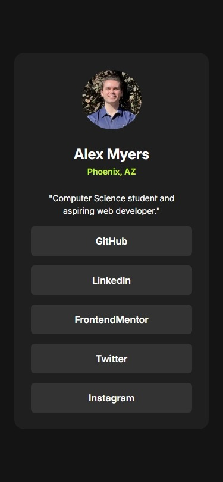
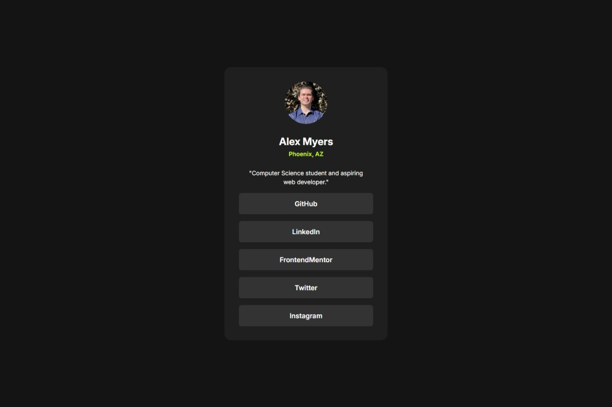

# Frontend Mentor - Social links profile solution

This is a solution to the [Social links profile challenge on Frontend Mentor](https://www.frontendmentor.io/challenges/social-links-profile-UG32l9m6dQ). Frontend Mentor challenges help you improve your coding skills by building realistic projects. 

## Table of contents

- [Overview](#overview)
  - [The challenge](#the-challenge)
  - [Screenshots](#screenshot)
  - [Links](#links)
- [My process](#my-process)
  - [Built with](#built-with)
  - [Continued development](#continued-development)
- [Author](#author)

## Overview

### The challenge

Users should be able to:

- See hover and focus states for all interactive elements on the page

### Screenshots

### Links

- Solution URL: (https://github.com/alexrtm/social-links-profile)
- Live Site URL: (https://alexrtm.github.io/social-links-profile/)

## My process

### Built with

- Semantic HTML5 markup
- CSS custom properties
- Mobile-first workflow

### Continued development

1. Deepening Knowledge of Responsive Design
  *Objective: Continue experimenting with advanced CSS techniques for responsive design, such as calc(), clamp(), and fluid typography. Focus on mastering flexible layouts that adapt well across various devices.
  *Next Steps: Test your designs on multiple devices and screen sizes, refine your use of relative units, and consider incorporating CSS Grid or Flexbox for more complex layouts.
2. Enhancing Accessibility
  *Objective: Focus on improving accessibility by ensuring color contrast, using semantic HTML, and refining keyboard navigation (e.g., focus states, screen reader compatibility).
  *Next Steps: Audit your projects using tools like Lighthouse or WAVE to identify and resolve accessibility issues. Study ARIA roles and how they can enhance the accessibility of more complex components.
3. Refining UI/UX Design Skills
  *Objective: Develop an eye for design by experimenting with color schemes, typography, and interactive states (hover, focus). Aim to create visually appealing, user-friendly interfaces.
  *Next Steps: Learn more about UI design principles, explore design systems (e.g., Material Design, Bootstrap), and practice creating cohesive and attractive visual designs.
4. Strengthening Code Efficiency and Maintainability
  *Objective: Write cleaner, more maintainable code by avoiding redundancy, consolidating styles, and organizing your CSS effectively.
  *Next Steps: Refactor your code regularly, learn about CSS methodologies like BEM (Block, Element, Modifier), and consider using preprocessors like Sass to manage larger stylesheets efficiently.
5. Experimenting with Advanced CSS Techniques
  *Objective: Explore more advanced CSS features like custom properties (CSS variables), pseudo-elements, and transitions/animations to create dynamic and engaging user experiences.
  *Next Steps: Implement complex UI elements (e.g., modals, accordions) using pure CSS, explore CSS animations, and practice creating reusable styles with CSS variables.
6. Expanding Your JavaScript Skills
  *Objective: Integrate JavaScript to add interactivity, such as focus management, dynamic content updates, or form validation, to your projects.
  *Next Steps: Start with small enhancements, like focus trapping within modals or simple form validation, and gradually move towards more complex interactions. Familiarize yourself with ES6+ features to write modern, efficient JavaScript.

## Author

- Frontend Mentor - [@alexrtm](https://www.frontendmentor.io/profile/alexrtm)

